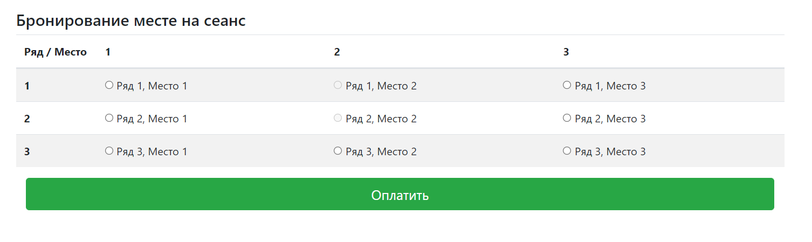
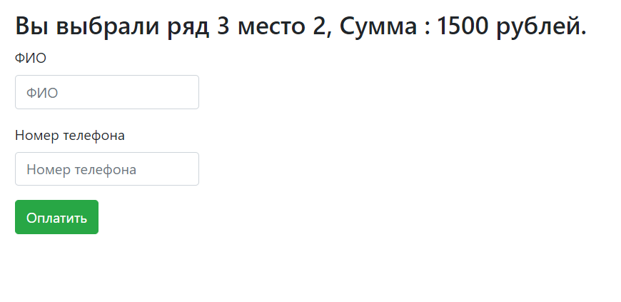

# CINEMA Application
Application for selling cinema tickets. After choosing a seat, the user is redirected to the payment page. After payment, the place becomes inactive on the main page.

## Technologies used

- Java 11, Java Servlet API
- JDBC, PostgreSQL, Liquibase
- HTML, Java Script, AJAX, Bootstrap

